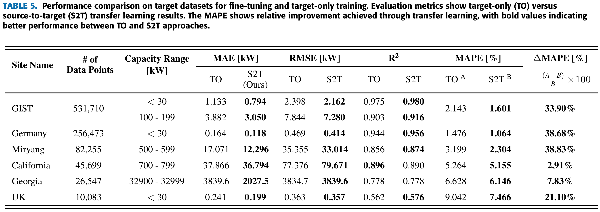

# Transfer Learning for PV Power Forecasting Across Regions Using Large-Scale Datasets

Seongho Bak, Sowon Choi, Donguk Yang, Doyoon Kim, Heeseon Rho, and Kyoobin Lee

## Key Concepts

:star2: **Large PV data**: We use a large-scale PV dataset. The dataset contains 1-hour resolution data mainly from [DKASC](https://dkasolarcentre.com.au/) (Desert Knowledge Australia Solar Centre)

:star2: **Validated on the Various Sites**: The trained model is validated on 4 different countries (England, Germany, Korea, and USA) and each countries has multiple sites. 


The data pipeline and transfer learning process start with gathering and refining the large-scale source data for training. The large size of the source data is gathered and then refined for training a model. The transformer-based model is trained with a large-scale source dataset to create the pre-trained model. With the pre-trained model, each local power generator can predict their local site.

## Results


To compare the performance of each target dataset, we compare target- only (TO), which is trained using only the target dataset, and source-to-target (S2T), which is transferred based on the pre-trained model trained on the source dataset. The results demonstrate that transfer learning improves MAPE across all datasets, with additional improvements observed in other performance metrics

## Getting Started

Our model basically comes from the PatchTST model. We modified the model to fit the PV power forecasting task.
Though you can follow the instructions from the original PatchTST repo, we provide the detailed instructions for the PV power forecasting task.

1. Install pytorch. You can install pytorch from the official website: https://pytorch.org/get-started/locally/  
   (However, we tested on pytorch 2.0.1, CUDA 11.7.)

2. Install requirements. ```pip install -r requirements.txt```

3. Download data (Please tell us if you need the data.).
4. Put the data in the ```./data``` directory.  
   The directory structure should be as follows:
   ```
    ./data
    ├── DKASC
    │   ├── CSV file 01
    │   ├── CSV file 02
    │   └── ...
    ├── GIST
    │   ├── CSV file 01
    │   ├── CSV file 02
    │   └── ...
   
   ```
   The detailed information about the data preprocessing is in the `./data_preprocessing/DATA_PREPROCESSING.md` .

5. Run `./run_longExp.py` for a single experiment.   
   You can adjust the hyperparameters based on your needs (e.g. different patch length, different look-back windows, prediction lengths etc.).

6. (Optional) If you want to run experiments on sequentially, you can use the bash files on `./scripts/PatchTST` directory.  
   For example, if you want to run a single site of DKASC experiment (`79-Site_DKA-M6_A-Phase.csv`) with changing the prediction length, you can run the following command:  
   ```
   sh ./scripts/PatchTST/DKASC_single.sh
   ``` 


## Acknowledgement and Data Sources

We appreciate the following github repo and sites very much for the valuable code base and datasets:

PatchTST: https://github.com/yuqinie98/PatchTST

DKASC: https://dkasolarcentre.com.au/

Household Data: https://data.open-power-system-data.org/household_data/

PVDAQ: https://data.openei.org/submissions/4568 (2023 DOE Solar Data Prize)
- [2017_OEDI](https://data.openei.org/s3_viewer?bucket=oedi-data-lake&prefix=pvdaq%2F2023-solar-data-prize%2F2107_OEDI%2F) for Arbuckle, California
- [9069_OEDI](https://data.openei.org/s3_viewer?bucket=oedi-data-lake&prefix=pvdaq%2F2023-solar-data-prize%2F9069_OEDI%2F) for Social Circle, Georgia

Photovoltaic (PV) Solar Panel Energy Generation data: https://data.london.gov.uk/dataset/photovoltaic--pv--solar-panel-energy-generation-data?q=solar%20pane

Datasets including GIST, Miryang, and preprocessed data are available at the following link ([Data](https://drive.google.com/drive/folders/11tDNAJxlSs12xFQWMFn5pWSBG_TGdhhn?usp=sharing)).

Trained model can be downloaded from the following link ([weight files](https://drive.google.com/drive/folders/1qm9_RJUNnWjZ48sIs_12cyXwsa4UPcHX?usp=sharing)).


## Contact

If you have any questions or concerns, please contact us: bakseongho@gm.gist.ac.kr or submit an issue

## Citation

If you find this repo useful in your research, please consider citing our paper as follows:

```
@inproceedings{
adding soon
}
```
